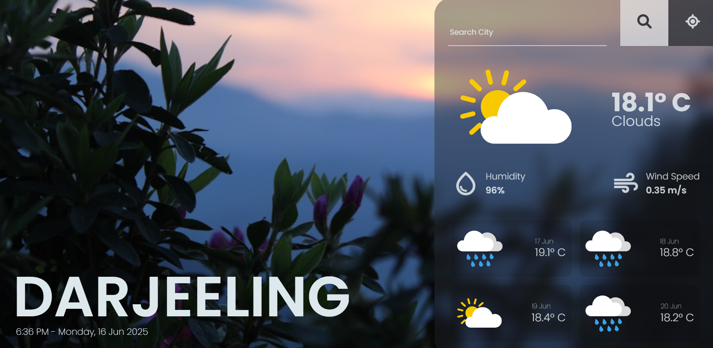
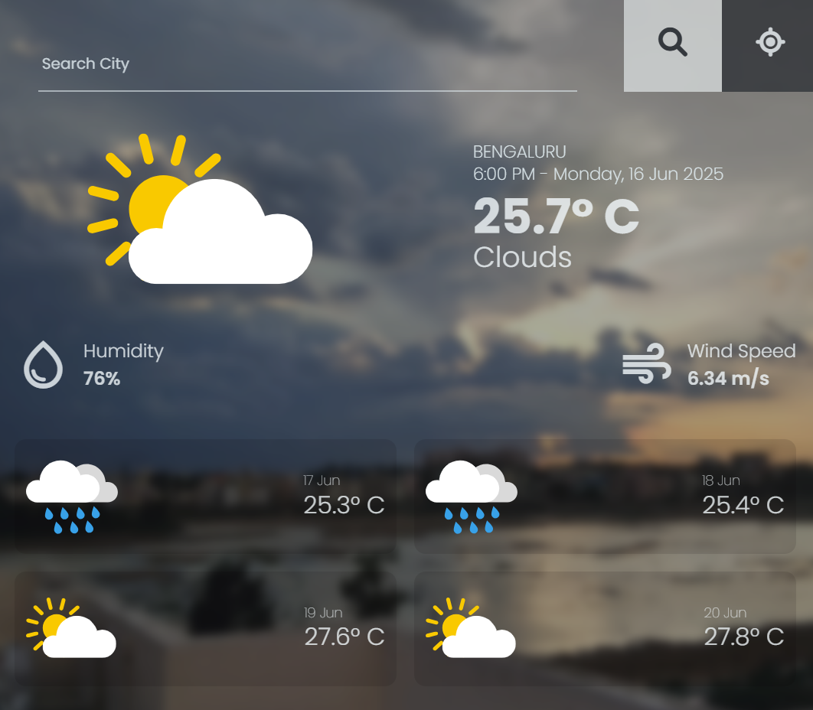

# 🌤️ Weather App

A clean and interactive weather application that shows the current time and weather conditions for any city, with beautiful dynamic backgrounds.

## 🔗 Live Demo

https://221sakshisharma.github.io/weather-app/

## 📸 Preview

## 🛠 Tech Stack

- **HTML**
- **CSS** (with transitions and responsive design)
- **Vanilla JavaScript**
- [**OpenWeatherMap API**](https://openweathermap.org/)
- [**Unsplash API**](https://unsplash.com/developers)
